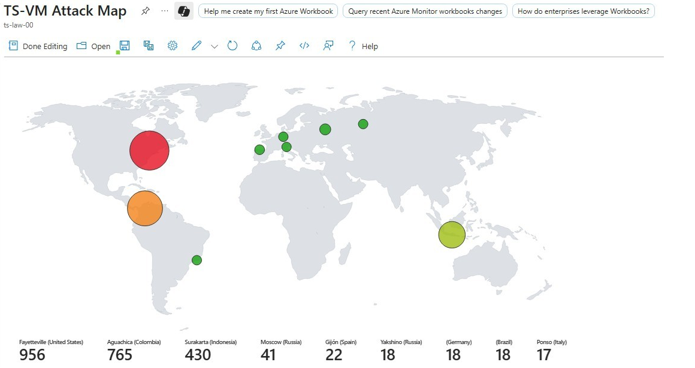
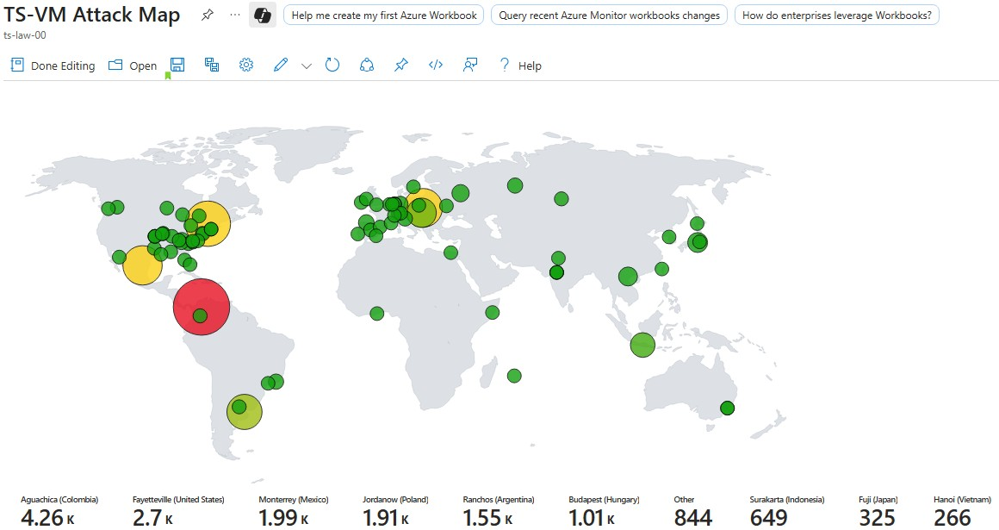

<h1>Home SOC Lab - Honeypot SIEM with Microsoft Sentinel</h1>

<h2>Description</h2>
This project demonstrates how I set up a honeypot virtual machine in Azure, collected attack data, and visualized it in Microsoft Sentinel. 
The goal was to simulate a real-world environment where attackers target exposed systems and then use SIEM tools to monitor and analyze those attempts.
<br />
<br />
  
| Component          | Details                                                        |  
|--------------------|----------------------------------------------------------------|
| **Platform**       | Microsoft Azure                                                |
| **VM OS**          | Windows 10 Pro                                                 |
| **Security Tools** | Microsoft Defender for Endpoint, Microsoft Sentinel (SIEM)     |

<h2>Project Overview</h2>

<h3>Azure Setup</h3>

- Deployed a resource group, virtual network, and Windows 10 VM in Azure.

- Modified the Network Security Group (NSG) to allow open inbound access and disabled the VM firewall, intentionally making it vulnerable.

- Result: within hours, attackers from multiple regions attempted RDP connections.

<h3>Log Analytics + Sentinel</h3>

- Created a Log Analytics Workspace (LAW) and connected it to Microsoft Sentinel.

- Installed the Azure Monitoring Agent on the VM and configured a Data Collection Rule to gather Windows Security Event Logs.

<h3>Threat Visualization</h3>

- Imported a GeoIP watchlist (IP ranges + location data).

- Built a Sentinel Workbook with KQL queries to plot attacker locations on an interactive map.

- The dashboard shows city, country, and frequency of attacks, providing real-time threat visibility.

<h3>Early Stage (1 hour post setup):</h3>

- The honeypot records minimal but noticeable attack traffic

<p align="center">
  
</p>

<h3>Later Stage (6 hours post setup):</h3>

- Heavy malicious traffic observed compared to the first hour

<p align="center">
  
</p>

<!--
 ```diff
- text in red
+ text in green
! text in orange
# text in gray
@@ text in purple (and bold)@@
```
--!>
